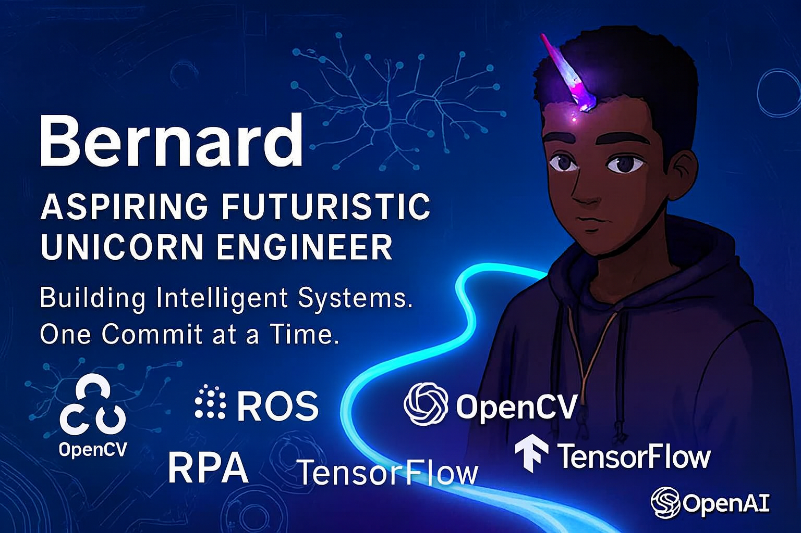

# 👋 Hi, I'm Bernard

## 🚀 About Me

I'm a **Mechanical Engineering graduate** on a 6-year journey to become a **Full-Stack AI + Robotics Engineer**.  
Currently, I'm focused on the first 24 months: mastering AI engineering through Python, ML systems, and public documentation.

I blend mechanical intuition with intelligent software to build systems that think, move, and adapt.

🧠 **Current Focus:**
- Python fundamentals (data structures, OOP, error handling)
- GUI development with tkinter and Streamlit
- Data visualization with Plotly
- Building small tools and documenting the process

🦄 **Identity Statement:**
I’m building intelligent systems—one line of code, one insight, one iteration at a time.  
My long-term goal is to become a **Futuristic Unicorn Engineer**: someone who blends mechanical depth with intelligent software to create scalable, interpretable, and impactful solutions.

---

## 🧪 My Builder’s Lab

My main workspace is [`Agenda-6-years`](https://github.com/bamoah30/Agenda-6-years), where I document my transformation in real time.

Supporting tools:
- ⏱️ [`PomodoroApp`](https://github.com/bamoah30/PomodoroApp): Focus timer for deep work  
- 📈 [`AI Roadmap Tracker`](https://github.com/bamoah30/Ai-roadmap-tracker): Visual milestone tracker

Archived attempts:
- `Project-100-days-of-coding` and `python-course_2025` reflect early experiments and learning pivots.

---

## 🛠️ Tech Stack (Learning in Progress)

**Languages:**  

**Tools & Frameworks:**  

---

## 📚 Learning Journey

I’m following a 24-month roadmap to build intelligent systems from scratch.  
You can explore the roadmap [here](https://github.com/bamoah30/Agenda-6-years).

**Milestones:**
- ✅ Week 3: Python fundamentals underway  
- 🔜 Week 4: First GitHub project (AI Data Analyzer)  
- 🛠️ Month 6: Deploy ML web app + dashboard  
- 🧠 Month 12: Build predictive maintenance system

---

## 📈 GitHub Stats

---

## 🌟 2025–2027 Goals

- ✅ Learn Python, SQL, and ML fundamentals  
- ✅ Build and deploy 6+ intelligent systems  
- ✅ Contribute to open-source AI tools  
- ✅ Launch robotics experiments and public demos  
- ✅ Build a timeless brand as a Futuristic Unicorn Engineer

---

## 📫 Let’s Connect

- 💼 LinkedIn: [linkedin.com/in/bernard-ai](https://linkedin.com/in/bernard-ai)  
- 🧠 Roadmap: [Agenda-6-years](https://github.com/bamoah30/Agenda-6-years)  
- 📧 Email: bamoah847@gmail.com

---

**“The future belongs to those who build it. I’m building mine—one commit at a time.”**  
*— Bernard, aspiring Futuristic Unicorn Engineer*

